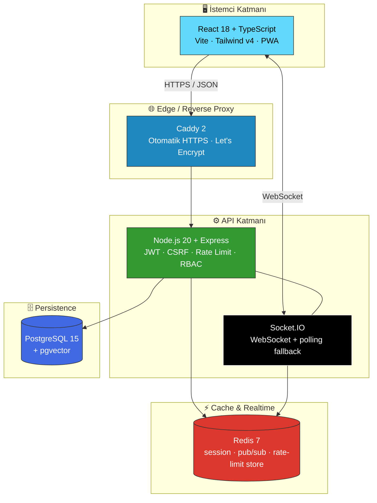
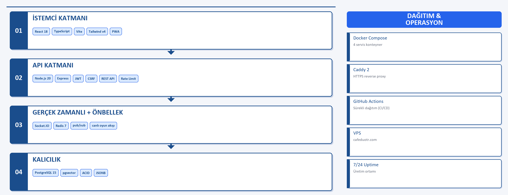

<div align="center">

# ☕ CafeDuo

**Üniversite kafelerinde müşteri–işletme bağını oyunlaştırma ile güçlendiren web platformu**

[](https://cafeduotr.com)
[](https://github.com/eminemrre/cafeduo-main/actions/workflows/ci.yml)
[](https://github.com/eminemrre/cafeduo-main)
[](https://github.com/eminemrre/cafeduo-main)
[](LICENSE)
[](https://nodejs.org)
[](https://www.typescriptlang.org/)
[](https://react.dev)
[](https://www.postgresql.org)
[](https://redis.io)
[](https://www.docker.com)
[](https://dokploy.com)

[**🚀 Canlı Demo →**](https://cafeduotr.com) · [**📖 API Dökümanı**](https://cafeduotr.com/api-docs) · [**🐛 Hata Bildir**](https://github.com/eminemrre/cafeduo-main/issues)

</div>

---

> **30 saniyelik özet** — CafeDuo, üniversite kafelerinde müşteri sadakatini **oyunlaştırma (gamification)** yoluyla güçlendiren web tabanlı bir platformdur. Kullanıcılar GPS+PIN ile kafe masasında check-in yapar, 2 kişilik gerçek zamanlı oyunlar oynar (Nişancı Düellosu, Bilgi Yarışı, Retro Satranç), puan kazanır ve bu puanları o kafenin ödüllerine dönüştürür. **React 18 + Node.js 20 + PostgreSQL 15 + Socket.IO** üzerine kuruludur; **Octalysis Framework**'ün 8 motivasyon sürücüsünden 7'sini aktif kullanır; üretim ortamında 7/24 [cafeduotr.com](https://cafeduotr.com) adresinde çalışmaktadır.

## 📑 İçindekiler

- [Öne Çıkan Özellikler](#-öne-çıkan-özellikler)
- [Mimari](#️-mimari)
- [Teknoloji Yığını](#️-teknoloji-yığını)
- [Hızlı Başlangıç](#-hızlı-başlangıç)
- [Kullanım Akışı ve Roller](#-kullanım-akışı-ve-roller)
- [Oyunlar](#-oyunlar)
- [Test ve Kalite](#-test-ve-kalite)
- [Güvenlik](#-güvenlik)
- [Üretim Dağıtımı](#-üretim-dağıtımı)
- [Yol Haritası](#-yol-haritası)
- [Lisans ve Katkı](#-lisans-ve-katkı)

## ✨ Öne Çıkan Özellikler

|     | Özellik                         | Açıklama                                                                    |
| --- | ------------------------------- | --------------------------------------------------------------------------- |
| 📍  | **GPS + PIN check-in**          | Geofencing ile kafe konumu doğrulanır; masaya günlük PIN ile kilitlenir     |
| 🎮  | **3 gerçek zamanlı oyun**       | Nişancı Düellosu (refleks), Bilgi Yarışı (150 soruluk havuz), Retro Satranç |
| 💰  | **Puan ekonomisi**              | Atomik settlement, maksimum stake 150 puan, kafe-bazlı bakiye               |
| 🎟️  | **Kafe-scope'lu kupon sistemi** | `CD-XXXX-XXXX-XXXX` formatı, 5 gün ömür, yalnızca alındığı kafede geçerli   |
| 👥  | **3 rolle RBAC**                | `user` / `cafe_admin` / `admin` — middleware tabanlı strict izolasyon       |
| 🏆  | **Başarımlar & Lider Tablosu**  | Octalysis PBL üçlüsü — puan, rozet, leaderboard                             |
| 🎰  | **Günlük çark**                 | `Europe/Istanbul` TZ unique index; her kafe kendi çark içeriğini yönetir    |
| 🛡️  | **OWASP Top 10 uyumlu**         | JWT+CSRF double-submit, bcrypt cost=12, parametreli SQL, rate limiting      |
| 📱  | **PWA (kurulabilir)**           | Offline-first cache, mobilde otomatik zorluk ayarı                          |
| 🌐  | **Otomatik HTTPS**              | Caddy 2 + Let's Encrypt; Dokploy ile push-to-deploy                         |
| 🧠  | **Akademik temel**              | Octalysis (Chou, 2015) + Öz Belirleme Kuramı (Deci & Ryan)                  |
| 📊  | **Gözlemlenebilir**             | Sentry APM, Winston structured logs, opsiyonel Prometheus stack             |

## 🏗️ Mimari



<details>
<summary>📷 <b>Yüksek çözünürlüklü mimari diyagramı (PNG)</b></summary>



</details>

**4 katmanlı yapı:** İstemci → Edge → API/Realtime → Persistence. Tüm servisler Docker Compose'da konteynerize edilmiştir; tek `docker compose up` komutuyla ayağa kalkar.

## ⚙️ Teknoloji Yığını

| Katman            | Teknoloji                                     | Tercih Sebebi                                                               |
| ----------------- | --------------------------------------------- | --------------------------------------------------------------------------- |
| **Frontend**      | React 18 · TypeScript 5 · Vite · Tailwind v4  | Tip güvenliği, hızlı HMR, geniş ekosistem                                   |
| **Backend**       | Node.js 20 · Express                          | Frontend ile aynı dil; event-driven model gerçek zamanlı oyunlar için ideal |
| **Veritabanı**    | PostgreSQL 15 · pgvector                      | ACID, JSONB, vektör arama (gelecek AI özellikleri için altyapı)             |
| **Önbellek**      | Redis 7                                       | Sub-ms gecikme; pub/sub; rate-limit ve JWT blacklist store                  |
| **Realtime**      | Socket.IO                                     | WebSocket + polling fallback (zayıf bağlantı dayanıklılığı)                 |
| **Kapsayıcı**     | Docker · Docker Compose                       | 4 servis (postgres / redis / api / web), taşınabilir                        |
| **Reverse Proxy** | Caddy 2                                       | Otomatik HTTPS, sıfır-konfig Let's Encrypt                                  |
| **CI / CD**       | GitHub Actions · Dokploy                      | `main`'e her push → otomatik build + deploy                                 |
| **Test**          | Jest · React Testing Library · Playwright     | 898 unit/integration + smoke E2E                                            |
| **Gözlemleme**    | Sentry APM · Winston · (opsiyonel) Prometheus | Structured logs, hata izleme, metrik                                        |

## 🚀 Hızlı Başlangıç

### 🐳 Docker Compose (önerilen — tek komutla ayakta)

```bash
git clone https://github.com/eminemrre/cafeduo-main.git
cd cafeduo-main
cp .env.example .env       # JWT_SECRET, BOOTSTRAP_ADMIN_EMAILS vs. düzenle
docker compose up -d
```

Servis ayağa kalktıktan sonra:

| Servis             | URL                            |
| ------------------ | ------------------------------ |
| Web                | http://localhost:8080          |
| API                | http://localhost:3001          |
| API Docs (Swagger) | http://localhost:3001/api-docs |
| Health probe       | http://localhost:3001/health   |

### 💻 Yerel Geliştirme (Windows / PowerShell)

```powershell
# Bağımlılıklar
npm install

# Ortam değişkenleri
copy .env.example .env

# Veritabanı + cache (sadece postgres/redis container)
docker compose up -d postgres redis
npm run migrate:up

# Frontend + backend birlikte (hot reload)
npm run dev
```

Yerel endpoint'ler:

|                 | URL                            |
| --------------- | ------------------------------ |
| Frontend (Vite) | http://localhost:5173          |
| Backend         | http://localhost:3001          |
| API Docs        | http://localhost:3001/api-docs |

<details>
<summary>📋 <b>Tüm npm script'leri</b></summary>

```bash
npm run dev              # Frontend + backend hot reload
npm run dev:frontend     # Sadece Vite (5173)
npm run dev:backend      # Sadece API (3001)
npm run build            # Üretim build (Vite)
npm run test             # Jest unit + integration
npm run test:ci          # CI modu + coverage raporu
npm run test:e2e         # Playwright smoke
npm run lint             # ESLint
npm run typecheck        # tsc --noEmit
npm run migrate:up       # DB migration ileri
npm run migrate:down     # DB migration geri al
npm run migrate:status   # Pending migration kontrolü
```

</details>

## 🎯 Kullanım Akışı ve Roller

```
1️⃣ Kayıt / Giriş  →  2️⃣ Kafe seç + GPS doğrula  →  3️⃣ Masa PIN  →  4️⃣ Oyun başlat
                                                                              ↓
6️⃣ Kuponu QR ile kullan  ←  5️⃣ Puanları kafe ödülüne çevir  ←  Settlement (atomik tx)
```

| Rol               | Yetkinlikler                                                     |
| ----------------- | ---------------------------------------------------------------- |
| 👤 **user**       | Kafe check-in, oyun oynama, puan kazanma, kupon alma, başarımlar |
| ☕ **cafe_admin** | Kendi kafesinin konumu / PIN'i / ödülleri / çark içeriği         |
| 🛡️ **admin**      | Tüm kafeler, kullanıcılar, sistem ayarları, moderasyon           |

## 🎮 Oyunlar

| Oyun                 | Mekanik                                                                                             | Süre         | Skorlama                              |
| -------------------- | --------------------------------------------------------------------------------------------------- | ------------ | ------------------------------------- |
| **Nişancı Düellosu** | Hareket eden gauge'u (0-100) merkeze (50) yakın durdur. Mobilde otomatik zorluk: step=7, tick=32 ms | 5 tur        | Merkez yakınlığı (3 / 2 / 1 / 0 puan) |
| **Bilgi Yarışı**     | 150 soruluk havuzdan deterministik seed ile 10 soru, 4 şık                                          | 15 sn / soru | Toplam doğru cevap                    |
| **Retro Satranç**    | `chess.js` üzerinde FEN notasyonu, çift-yönlü hamle doğrulama                                       | Tur sınırsız | Mat                                   |

**Ortak settlement:** Kazanan, `min(stake, kaybeden.bakiyesi)` kadar puan kazanır. Maksimum stake **150 puan**; tüm puan transferleri atomik PostgreSQL transaction içinde yapılır.

## 🧪 Test ve Kalite

| Metrik                       | Değer                                    |
| ---------------------------- | ---------------------------------------- |
| Birim / entegrasyon testleri | **898 passing** (91 test dosyası)        |
| Satır kapsama                | **%67** (Google standardı %60-80 içinde) |
| Dal kapsama                  | **%54**                                  |
| E2E (Playwright)             | Smoke (kritik akış) + advanced realtime  |
| Conventional Commits         | **300+** commit, `main`'de               |
| CI çalıştırma süresi         | ~30 sn unit · ~3 dk full pipeline        |

```bash
npm run test:ci    # 898 test + coverage raporu
npm run test:e2e   # Smoke senaryolar
```

## 🔐 Güvenlik

OWASP Top 10 karşılığı uygulanan kontroller:

| Saldırı kategorisi                | Kontrol                                                                    |
| --------------------------------- | -------------------------------------------------------------------------- |
| **A01 Broken Access Control**     | RBAC + middleware (`requireAdmin`, `requireCafeAdmin`, `requireOwnership`) |
| **A02 Cryptographic Failures**    | bcrypt cost=12, JWT secret ≥64 hex, HTTPS-only cookie                      |
| **A03 Injection**                 | %100 parametreli SQL (prepared statement), `SELECT *` yasak                |
| **A05 Security Misconfiguration** | Helmet, CSP, Caddy auto-HTTPS, secrets sadece env'de                       |
| **A07 Identification Failures**   | Rate limit (login 15 dk / 20 deneme), JWT Redis blacklist                  |
| **CSRF**                          | Double-submit cookie + custom header pattern                               |
| **XSS**                           | React JSX otomatik escape; inline HTML kullanılmaz                         |
| **KVKK**                          | Minimum kişisel veri (e-posta, kullanıcı adı, opsiyonel avatar)            |

Detaylar: [SECURITY.md](./SECURITY.md)

## 🚢 Üretim Dağıtımı

Üretim akışı tek tetiklidir: `git push origin main`.

```
git push origin main
        ↓
Dokploy GitHub watcher (~1 dk)
        ↓
docker compose build + recreate
        ↓
Caddy + Let's Encrypt (otomatik sertifika)
        ↓
https://cafeduotr.com ✅
```

Detaylı kurulum rehberi: [DEPLOYMENT.md](./DEPLOYMENT.md)

<details>
<summary>🔑 <b>Üretim ortam değişkenleri</b> (Dokploy panelinde tutulur, repo'ya commit edilmez)</summary>

| Değişken                         | Açıklama                                                  |
| -------------------------------- | --------------------------------------------------------- |
| `JWT_SECRET`                     | 64+ random hex karakter                                   |
| `DATABASE_URL`                   | PostgreSQL bağlantı string'i                              |
| `REDIS_URL`                      | Redis bağlantı string'i                                   |
| `CORS_ORIGIN`                    | Frontend public origin                                    |
| `BLACKLIST_FAIL_MODE`            | `closed` (token blacklist erişilemezse istek redde gider) |
| `RATE_LIMIT_PASS_ON_STORE_ERROR` | `false` (Redis erişilemezse istek redde gider)            |
| `SENTRY_DSN`                     | Sentry APM (opsiyonel)                                    |
| `BOOTSTRAP_ADMIN_EMAILS`         | İlk admin hesabı için e-posta listesi                     |
| `BOOTSTRAP_ADMIN_PASSWORD`       | Bootstrap admin parolası (sadece ilk başlatma)            |

</details>

## 🛤️ Yol Haritası

- [x] MVP: kimlik, check-in, 3 oyun, puan ekonomisi, kupon, RBAC
- [x] Üretim dağıtımı + otomatik HTTPS + Dokploy CI/CD
- [x] Sentry APM + structured logging
- [x] 898 test, %67 satır kapsama
- [ ] Native uygulama (React Native) — GPS spoofing tespiti için `FLAG_MOCK_LOCATION`
- [ ] **Streak mekaniği** (Octalysis 8. sürücü: Kayıp Kaçınma) — etik sınırlar gözetilerek
- [ ] B2B SaaS abonelik portali (kafe sahibi self-service onboarding)
- [ ] Çoklu dil desteği (EN, AR)
- [ ] Empirik etki anketi modülü (literatür için ölçüm verisi)

## 📄 Lisans ve Katkı

- **Lisans:** [MIT](./LICENSE)
- **Katkı kuralları:** [CONTRIBUTING.md](./CONTRIBUTING.md)
- **Güvenlik açığı bildirimi:** [SECURITY.md](./SECURITY.md)
- **Davranış kuralları:** [CODE_OF_CONDUCT.md](./CODE_OF_CONDUCT.md)

Pull request açmadan önce `npm run test:ci && npm run lint && npm run typecheck` komutlarının sorunsuz çalıştığından emin olun.

---

<div align="center">

**CafeDuo** — Made with ☕ & ❤️ in Türkiye

⭐ Bu projeyi faydalı buldunsanız Star bırakmayı unutmayın

</div>
